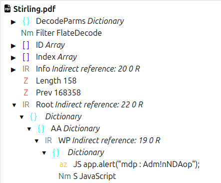

# Stirling

## Consigne
Dans ce challenge de difficulté 2/5, vous devez trouver le flag qui se cache parmi les fichiers.

## Description
On nous donne un .zip contenant 2 fichiers PDF : 
-NDA (Non Disclosure Agreement) -Stirling

NDA requiert un mot de passe pour être ouvert. On se doute alors qu'il se cache dans le second fichier, qui contient une démonstration mathématique de la formule de Stirling.

Il faut chercher dans ce PDF tout ce qui pourrait constituer un mot de passe pour NDA. 

## Indice
La solution pourrait être cachée dans le code source du PDF.

## Solution
Soit on est malin et on trouve le flag en essayant d'imprimer le PDF, ce qui affiche le mot de passe. 

Sinon, la solution bruteforce consiste a chercher le code javascript caché dans le PDF. De nombreux outils permettent de le faire, toutefois certains peuvent être couteux ou peu efficaces. Pour ma part, j'ai utilisé pdfux dot com :

On y trouve le mot de passe :
Adm!nNDAop, qui permet d'ouvrir le fichier PDF NDA, nous donnant le flag.

## Flag
heyJSPDFEmb3d3d